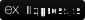
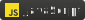
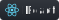
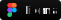

## 👋 Hi there, I'm Oleksandr Tsvik

### My stack and tools:

<table>
  <tbody>
    <tr>
      <td valign="top"><b>Backend</b></td>
      <td>
        
        
        
        
        
        
      </td>
    </tr>
    <tr>
      <td valign="top"><b>Frontend</b></td>
      <td>
        
        
        
        
        
        
      </td>
    </tr>
    <tr>
      <td valign="top"><b>Databases</b></td>
      <td>
        
        
        
        
      </td>
    </tr>
    <tr>
      <td valign="top"><b>Cloud</b></td>
      <td>
        
        
      </td>
    </tr>
  </tbody>
</table>
